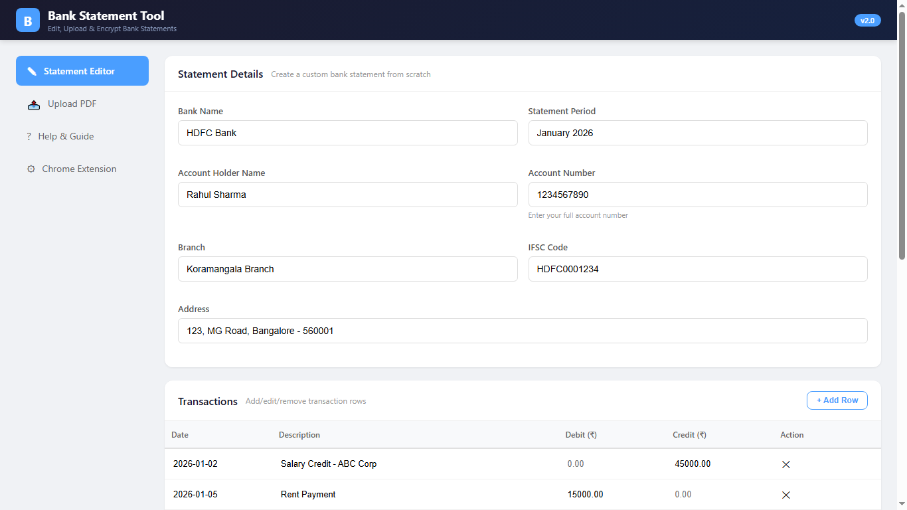
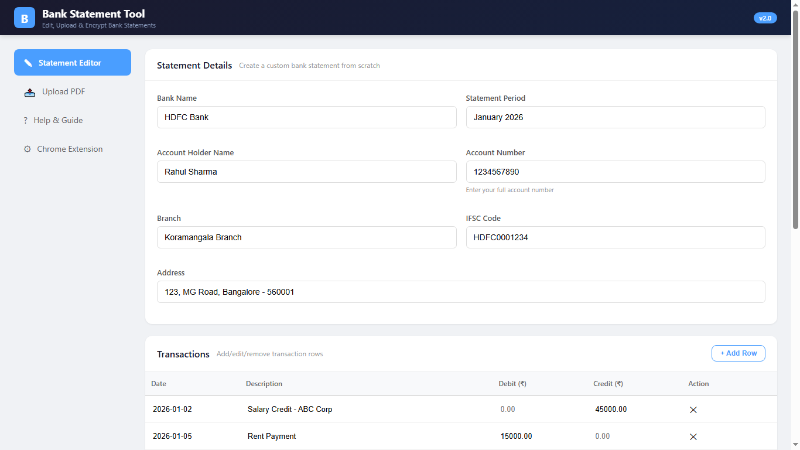
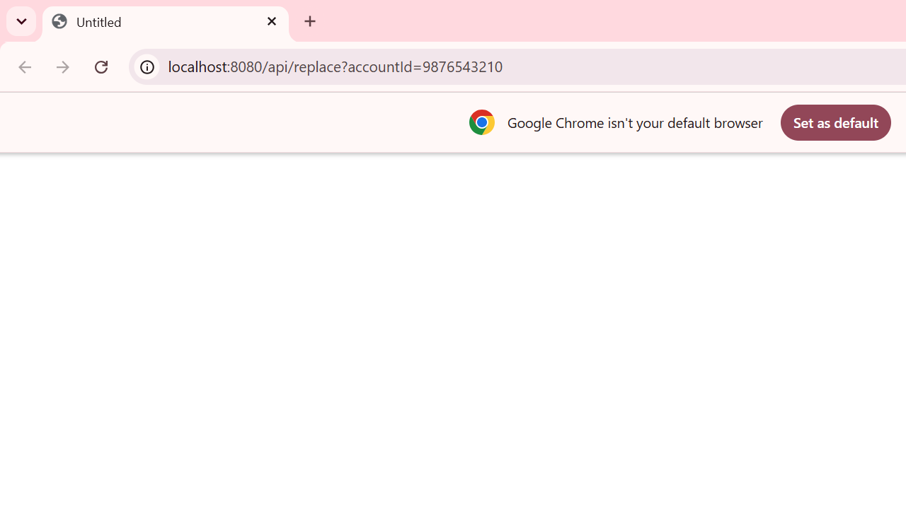

# Bank Statement Replacer

Replace real bank statement PDFs from your bank's website/email with custom edited PDFs — served instantly via a local intercept proxy (Spring Boot + Chrome Extension).

## How It Works

```
1. Bank sends statement PDF → you click it in Gmail/bank website
2. Chrome Extension intercepts the PDF URL request
3. Request is redirected to localhost:8080/api/replace?accountId=XXXXX
4. Spring Boot serves your pre-uploaded or editor-generated PDF instead
5. PDF opens instantly — no password, no difference visible to the user
```

## Features

- **Statement Editor** — Fill bank name, account holder, transactions, balances, and generate a professional PDF
- **Upload PDF** — Upload any pre-edited PDF (your real statement edited in any PDF tool) for automatic replacement
- **Chrome Extension** (MV3) — Intercepts bank PDF downloads via `declarativeNetRequest`, redirects to your local server
- **No database** — Everything runs in-memory. One JAR, zero setup.
- **No password prompt** — Replaced PDFs open instantly (no encryption on replace flow)
- **AES-256 available** — Editor also supports encrypted PDF download for other use cases

## Prerequisites

- **Java 17+** (tested with Java 24)
- **Maven 3.8+**
- **Chrome browser** (for extension)

## Quick Start

### 1. Build & Run

```bash
cd backend
mvn clean package -DskipTests
java -jar target/bank-editor-1.0.0.jar
```

Open http://localhost:8080 in your browser.

### 2. Upload Your Statement

Two ways:

**Option A — Upload a pre-edited PDF (recommended):**
1. Download the real statement from your bank
2. Edit it in any PDF editor (Adobe, preview, etc.)
3. Go to http://localhost:8080/#upload
4. Enter your **Account ID** (e.g., `1234567890`)
5. Drag & drop your edited PDF
6. Click **Upload**

**Option B — Generate a new statement via Editor:**
1. Go to http://localhost:8080
2. Fill in bank name, account holder, account number, transactions
3. Click **Download Plain PDF** (opens immediately — no password)
4. The generated PDF is also saved on the server for the replace endpoint

### 3. Install Chrome Extension

1. Open Chrome → `chrome://extensions/`
2. Enable **Developer mode** (toggle top-right)
3. Click **Load unpacked** → select the `extension/` folder
4. Click the extension icon in the toolbar
5. Enter your **Bank Domain** (e.g., `https://netbanking.hdfcbank.com`)
6. Enter your **Account ID** (e.g., `1234567890`)
7. Click **Save**

### 4. Test the Flow

**Without extension** — open in browser:
```
http://localhost:8080/api/replace?accountId=1234567890
```

**With extension** — navigate to any PDF URL on your configured bank domain. The extension will automatically redirect to your local server and serve your custom PDF.

## API Endpoints

| Method | Endpoint | Description |
|--------|----------|-------------|
| GET | `/api/replace?accountId=XXX` | Serve your custom PDF (no encryption) |
| POST | `/api/generate` | Generate + encrypt a PDF from JSON form data |
| POST | `/api/generate-plain` | Generate a plain PDF from JSON form data |
| POST | `/api/upload` | Upload a PDF for a specific account |
| GET | `/api/list` | List all uploaded + generated statements |

## Project Structure

```
email-statement/
├── backend/
│   ├── pom.xml                          # Maven config (Spring Boot 3.2, iText, BC)
│   └── src/main/
│       ├── java/com/bankeditor/
│       │   ├── BankEditorApplication.java
│       │   ├── config/WebConfig.java
│       │   ├── controller/StatementController.java
│       │   ├── service/PdfGenerationService.java
│       │   └── service/PdfEncryptionService.java
│       └── resources/static/
│           ├── index.html               # Web UI (all 4 tabs)
│           ├── css/style.css
│           └── js/app.js
├── extension/
│   ├── manifest.json                    # MV3 extension manifest
│   ├── background.js                    # declarativeNetRequest rules
│   ├── popup.html                       # Settings popup
│   └── popup.js
└── screenshots/
    ├── 01-web-ui-editor.png
    ├── 02-web-ui-upload.png
    ├── 03-web-ui-help.png
    ├── 04-web-ui-extension.png
    └── 05-pdf-in-chrome-viewer.png
```

## Screenshots

| Editor Tab | Upload Tab |
|---|---|
|  |  |

| Help & Guide | Chrome Extension |
|---|---|
|  |  |

| PDF in Chrome Viewer |
|---|
|  |

## End-to-End Test

```bash
# Ensure backend is running on port 8080

# 1. Generate encrypted PDF
curl -X POST http://localhost:8080/api/generate \
  -H "Content-Type: application/json" \
  -d '{"bankName":"HDFC Bank","accountNumber":"9876543210","accountHolder":"Test User","period":"June 2026","branch":"Main","ifsc":"HDFC0001234","address":"Address","openingBalance":"25000.00","totalDebits":"5000.00","totalCredits":"15000.00","closingBalance":"35000.00","transactions":[{"date":"2026-06-01","description":"Salary","debit":"","credit":"50000.00"},{"date":"2026-06-05","description":"Rent","debit":"15000.00","credit":""}]}' \
  -o encrypted-statement.pdf

# 2. Generate plain PDF
curl -X POST http://localhost:8080/api/generate-plain \
  -H "Content-Type: application/json" \
  -d '{"bankName":"HDFC Bank","accountNumber":"9876543210","accountHolder":"Test User","period":"June 2026","branch":"Main","ifsc":"HDFC0001234","address":"Address","openingBalance":"25000.00","totalDebits":"5000.00","totalCredits":"15000.00","closingBalance":"35000.00","transactions":[{"date":"2026-06-01","description":"Salary","debit":"","credit":"50000.00"},{"date":"2026-06-05","description":"Rent","debit":"15000.00","credit":""}]}' \
  -o plain-statement.pdf

# 3. Upload a PDF for replacement
curl -X POST http://localhost:8080/api/upload \
  -F "accountId=9876543210" \
  -F "file=@my-edited-statement.pdf"

# 4. Verify list
curl http://localhost:8080/api/list

# 5. Test replace endpoint (opens in browser / returns PDF)
curl http://localhost:8080/api/replace?accountId=9876543210 -o replaced.pdf

# 6. Test replace for generated account
curl http://localhost:8080/api/replace?accountId=1234567890 -o generated-replaced.pdf
```

## Troubleshooting

| Problem | Solution |
|---------|----------|
| Extension not intercepting | Check `chrome://extensions/` → Service Worker console for logs. Verify bank domain matches exactly. |
| Backend won't start | Ensure port 8080 is free: `netstat -ano \| findstr :8080`, then `taskkill /F /PID <PID>` |
| PDF doesn't open | The replace endpoint serves PDFs without encryption. Ensure your browser supports inline PDF viewing. |
| "Port already in use" | Kill zombie Java: `Get-Process java \| Stop-Process -Force` (PowerShell) |
