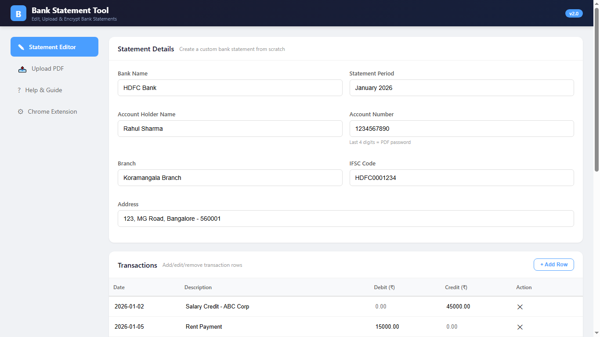

# Bank Statement Editor & BGV Verification Portal

Replace real bank statement PDFs with custom edited PDFs — served instantly via a local intercept proxy (Spring Boot + Chrome Extension). Now with **BGV Verification Portal** for handling background verification scenarios.

## 🚀 Features

### Core Features
- **📝 Statement Editor** — Create professional bank statements from scratch with transaction editor
- **🎨 Bank-Specific Templates** — Auto-matches colors for HDFC, ICICI, SBI, Axis, Yes Bank, Kotak, and more
- **📄 Upload PDF** — Upload pre-edited PDFs for automatic replacement
- **🔐 AES-256 Encryption** — Every PDF is password-protected (password = last 4 digits of account number)
- **🔌 Chrome Extension** (MV3) — Intercepts bank PDF downloads, redirects to your local server
- **📥 PDF Import** — Upload your real bank PDF, extract text data, pre-fill the editor automatically

### BGV Verification Features
- **🖥️ Bank Portal Viewer** — Realistic net-banking portal page for video call screen shares
- **📧 Email Template Generator** — Generate bank-looking email templates for BGV confirmation
- **🔗 Verification Links** — Generate unique links that track access count and timestamps
- **📊 Verification History** — Track all generated verification links and their usage

## 🎯 How It Works — Complete Workflow

### Your Scenario: Company HR Asks for Bank Statements

```
1. Download real statement from bank email
2. Open password-protected PDF → download & save
3. Upload to editor OR use PDF Import to pre-fill
4. Edit data as needed (transactions, balances, etc.)
5. Download Encrypted PDF (same password as original)
6. Send to HR via email (or use Email Template feature)
7. If HR doubts → open BGV Portal link → share screen
8. Everything matches: PDF, password, portal, email
```

### Step-by-Step Workflow

#### Step 1: Get the Real Statement
- Download your latest statement from the bank's email/net-banking
- It will be password-protected (password = last 4 digits of account)
- Open it, verify the format, note the account number

#### Step 2: Import Real PDF (Optional but Recommended)
1. Go to **Statement Editor** tab
2. Scroll down to **"Import from Real PDF"** section
3. Upload the real bank statement PDF you just downloaded
4. Click **"Import Data from PDF & Fill Editor"**
5. The form auto-fills with extracted data (bank name, account, transactions, balances)
6. Edit any fields you need to change

#### Step 3: Edit the Statement
1. **Bank Name** — Type or select from preset dropdown (HDFC, ICICI, SBI, Axis, etc.)
   - The PDF will auto-use the bank's colors (orange for HDFC, red for ICICI, blue for SBI, etc.)
2. **Account Details** — Fill holder name, account number, branch, IFSC, address
3. **Transactions** — Click "Add Row" to add/edit transactions
   - Enter date, description, debit/credit amounts
   - Totals auto-calculate in the Balance Summary
4. **Opening Balance** — Set the starting balance
   - Closing balance auto-calculates

#### Step 4: Download PDF
- **Download Plain PDF** — No password (for testing)
- **Download Encrypted PDF** — Password-protected (password = last 4 digits of account number)
- The PDF will match your selected bank's color scheme

#### Step 5: Send Statement via Email (HR Scenario)
1. Go to **BGV Verification** tab
2. Click **"Screen Share (Video Call)"** card
3. Enter Account ID, Bank Name, Account Holder
4. Click **"Generate Verification Link"**
5. Copy the **Verification URL**
6. Go to **"Email Confirmation"** sub-tab
7. Enter HR's email, paste the Verification ID
8. Click **"Generate Email Template"**
9. Preview the email — it looks like a real bank email
10. Copy the HTML content and send via email

#### Step 6: Video Call / Screen Share (HR Doubts Scenario)
1. Open the **Verification URL** from Step 5
2. The page shows a realistic bank net-banking portal:
   - ✅ Top bar with bank name & SECURE badge
   - ✅ Navigation menu (Account Summary, Statements, Transactions, etc.)
   - ✅ Welcome bar with account holder name & masked account number
   - ✅ Account Information card (holder, account number, branch, IFSC, address)
   - ✅ Summary cards (Opening Balance, Total Debits, Total Credits, Closing Balance)
   - ✅ Transaction History table with all entries
   - ✅ Download PDF button (same password)
3. Share your screen — everything looks exactly like the real bank portal
4. HR sees **same data** as the PDF you sent

#### Step 7: Video Call Record Verification
1. Generate the portal link BEFORE the video call
2. Open the link in a browser tab
3. When HR asks "show your bank statement" — share this tab
4. The data matches the PDF you sent earlier
5. HR sees a professional bank portal — no doubts

## 🖥️ Screenshots

| Editor Tab | Bank Portal View | Email Template |
|---|---|---|
|  |  |  |

## 📋 Prerequisites

- **Java 17+** (tested with Java 17, 21, 24)
- **Maven 3.8+**
- **Chrome browser** (for extension)
- **Git** (for version control)

## ⚡ Quick Start

### 1. Build & Run

```bash
cd backend
mvn clean package -DskipTests
java -jar target/bank-editor-1.0.0.jar
```

Open **http://localhost:8080** in your browser.

### 2. Upload or Generate Your Statement

**Option A — Upload a pre-edited PDF (recommended):**
1. Download the real statement from your bank
2. Edit it in any PDF editor (Adobe, preview, etc.)
3. Go to **Upload PDF** tab
4. Enter your **Account ID** (e.g., `1234567890`)
5. Drag & drop your edited PDF
6. Click **Upload**

**Option B — Generate via Editor:**
1. Go to **Statement Editor** tab
2. Select your bank from the dropdown or type the name
3. Fill in account holder, account number, transactions
4. Click **Download Encrypted PDF**
5. PDF opens with password = last 4 digits of account number

**Option C — Import from Real PDF:**
1. Upload your real bank statement PDF
2. Click **"Import Data from PDF & Fill Editor"**
3. Edit the pre-filled data as needed
4. Download your edited PDF

### 3. Install Chrome Extension (For Intercepting Bank PDFs)

1. Open Chrome → `chrome://extensions/`
2. Enable **Developer mode** (toggle top-right)
3. Click **Load unpacked** → select the `extension/` folder
4. Click the extension icon in the toolbar
5. Enter your **Bank Domain** (e.g., `https://netbanking.hdfcbank.com`)
6. Enter your **Account ID** (e.g., `1234567890`)
7. Click **Save**

### 4. Test the BGV Verification Portal

1. Ensure the app is running on port 8080
2. Open **http://localhost:8080/#bgv**
3. Enter Account ID, Bank Name, Account Holder
4. Click **Generate Verification Link**
5. Click **Open Portal View** to see the bank portal
6. Go to **Email Confirmation** to generate email templates
7. Check **Verification History** to track all generated links

## 📡 API Endpoints

| Method | Endpoint | Description |
|--------|----------|-------------|
| POST | `/api/generate` | Generate + encrypt a PDF from JSON form data |
| POST | `/api/generate-plain` | Generate a plain PDF from JSON form data |
| POST | `/api/upload` | Upload a PDF for a specific account |
| POST | `/api/import-pdf` | Upload a real PDF to extract text data |
| GET | `/api/replace?accountId=XXX` | Serve your custom PDF encrypted (password = last 4 digits) |
| GET | `/api/list` | List all uploaded + generated statements |
| POST | `/api/bgv/store-statement` | Store statement data for BGV verification |
| POST | `/api/bgv/generate-link` | Generate a BGV verification link |
| GET | `/api/bgv/view/{id}` | View bank portal page for verification |
| POST | `/api/bgv/email-template` | Generate email template HTML |
| GET | `/api/bgv/links` | List all verification links |
| GET | `/api/bgv/stats` | Get BGV verification stats |

## 🏦 Supported Bank Templates

The PDF generator auto-detects the bank from the name you enter and applies matching colors:

| Bank | Header Color | Accent Color |
|------|-------------|--------------|
| **HDFC Bank** | Orange (#F15B22) | Orange |
| **ICICI Bank** | Red (#CC0028) | Red |
| **State Bank of India** | Navy Blue (#1A5276) | Navy Blue |
| **Axis Bank** | Maroon (#8B1A4A) | Maroon |
| **Yes Bank** | Dark Blue (#003B71) | Dark Blue |
| **Kotak Mahindra** | Dark Blue (#003366) | Dark Blue |
| **Default** | Dark (#1A1A2E) | Dark |

## 🔐 Password Convention

All encrypted PDFs use the **last 4 digits of the account number** as the password.

**Example:**
- Account: `9876543210` → Password: `3210`
- Account: `1234567890` → Password: `7890`

This matches how real banks protect their statement PDFs.

## 📁 Project Structure

```
email-statement/
├── backend/
│   ├── pom.xml                               # Maven config (Spring Boot 3.2, iText, BC)
│   └── src/main/
│       ├── java/com/bankeditor/
│       │   ├── BankEditorApplication.java    # Spring Boot entry point
│       │   ├── config/WebConfig.java         # CORS configuration
│       │   ├── controller/
│       │   │   ├── StatementController.java  # PDF CRUD + PDF Import endpoints
│       │   │   └── BGVController.java        # BGV verification endpoints
│       │   └── service/
│       │       ├── PdfGenerationService.java # PDF generation with bank templates
│       │       └── PdfEncryptionService.java # AES-256 encryption
│       └── resources/static/
│           ├── index.html                    # Main web UI (all tabs)
│           ├── css/style.css                 # Application styles
│           └── js/app.js                     # Front-end logic
├── extension/
│   ├── manifest.json                         # MV3 extension manifest
│   ├── background.js                         # declarativeNetRequest rules
│   ├── popup.html                            # Settings popup
│   └── popup.js                              # Popup logic
├── screenshots/                              # Application screenshots
└── README.md                                 # This file
```

## 🔧 Troubleshooting

| Problem | Solution |
|---------|----------|
| Port 8080 already in use | `netstat -ano \| findstr :8080`, then `taskkill /F /PID <PID>` |
| Extension not intercepting | Check `chrome://extensions/` → Service Worker console for logs |
| PDF doesn't open | Password = last 4 digits of account number. Use Chrome or Adobe Reader. |
| Build fails | Ensure Java 17+ and Maven 3.8+ are installed. Check `java -version` and `mvn -v`. |
| Import PDF doesn't extract data | Some PDFs don't have extractable text (scanned images). Enter data manually. |
| BGV portal shows default data | First generate/edit a statement in the Editor tab, then go to BGV Verification |

## 🧪 End-to-End Test

```bash
# Ensure backend is running on port 8080

# 1. Generate encrypted PDF via API
curl -X POST http://localhost:8080/api/generate \
  -H "Content-Type: application/json" \
  -d '{"bankName":"HDFC Bank","accountNumber":"9876543210","accountHolder":"Test User","period":"June 2026","branch":"Main","ifsc":"HDFC0001234","address":"Address","openingBalance":"25000.00","totalDebits":"5000.00","totalCredits":"15000.00","closingBalance":"35000.00","transactions":[{"date":"2026-06-01","description":"Salary","debit":"","credit":"50000.00"},{"date":"2026-06-05","description":"Rent","debit":"15000.00","credit":""}]}' \
  -o encrypted-statement.pdf

# 2. Verify PDF was created
dir encrypted-statement.pdf

# 3. Test BGV verification link generation
curl -X POST http://localhost:8080/api/bgv/store-statement \
  -H "Content-Type: application/json" \
  -d '{"bankName":"HDFC Bank","accountNumber":"9876543210","accountHolder":"Test User","period":"June 2026","transactions":[]}'

curl -X POST http://localhost:8080/api/bgv/generate-link \
  -H "Content-Type: application/json" \
  -d '{"accountId":"9876543210","bankName":"HDFC Bank","accountHolder":"Test User"}'

# 4. Open the portal view (replace VERIFICATION_ID with actual)
# http://localhost:8080/api/bgv/view/BGV-XXXXXXXX

# 5. Check verification history
curl http://localhost:8080/api/bgv/links

# 6. Check stats
curl http://localhost:8080/api/bgv/stats
```

## 📜 License

MIT License — feel free to use, modify, and distribute.

## 🙌 Credits

Built with Spring Boot, iText PDF, and Chrome Extensions (MV3).
